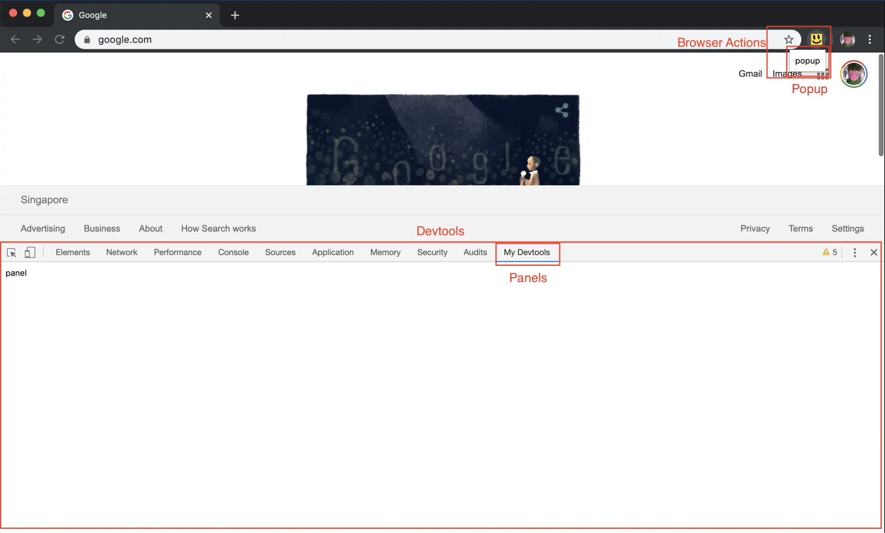

# Chrome extension hello world

## Overview

       **************************************
       *    _______          __________     *  
       *   | Popup |        | Devtools |    *     
       *    -------          ----------     *    
       *       \\                //         *   
       *    ____________________________    *   
       *   |        Background          |   * 
       *    ----------------------------    *     
       *  |-------------||---------------|  *      
       *                ||                  *        
       *         ________________           *       
       *        | Content script |          *       
       *         ----------------           *        
       *                ||                  *         
       *            __________              *     
       *           | Web page |             *         
       *            ----------              *    
       **************************************
       
Chrome devtools extensions have a number of components that can be interacted with. 
The above diagram shows the communication between the various components. From the screenshot
below you can see what the different elements belong to.

[Source](https://lihautan.com/personalised-development-workspace-with-chrome-extension/)

## Communications
The most important aspect to understand is how to communicate between your webpage and various
components.

### Content Script
The content script has access full access to the DOM and DOM events on the inspected web page.
The content script is also loaded before the webpage's script is loaded, which allows you to then inspect
all the DOM and any events the webpage might throw out.

### Content Script and beyond

There are various strategies that the chrome devtools extension docs explain to [communicate between
extension components](https://developer.chrome.com/extensions/devtools#solutions).

However, the one this extension uses is to have the `Background.js` be the communications bridge. [See long lived connections](https://developer.chrome.com/extensions/messaging#connect).

The background script can therefore send and receive messages between all the various components. In this extension,
I haven't yet got bi-directional communication (from the devtools to the content script), but it isn't something
that will take too much effort to add.

